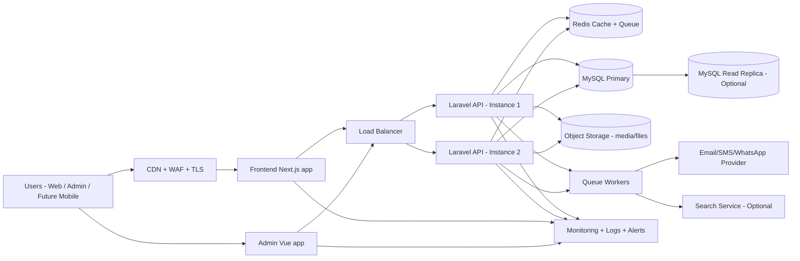
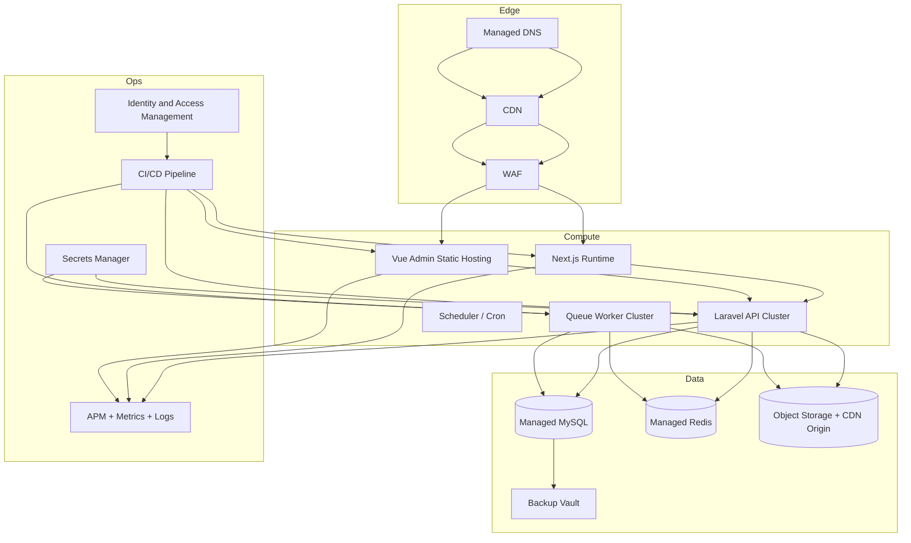

# Tashafy - Deployment Architecture Diagram and Infrastructure Plan

## 1) High-Level System Structure

## 2) Recommended Infrastructure (Production)

## 3) Required Services and Resources

| Layer | Service | Purpose | Starter Size | Scale Target |
|---|---|---|---|---|
| Edge | CDN + WAF + TLS | Performance, security, DDoS protection | 1 global distribution | Multi-region edge |
| Web | Next.js hosting | Public website runtime | 2 app instances (2 vCPU / 4 GB) | Auto-scale by traffic |
| Admin | Static hosting + CDN | Admin panel delivery | Static bucket + CDN | Same, low cost |
| API | Laravel app servers | Core business APIs | 2 instances (2 vCPU / 4 GB each) | 4-10 instances |
| Worker | Queue workers | Async jobs (email, media, notifications) | 1-2 instances (2 vCPU / 4 GB) | Horizontal workers |
| Scheduler | Cron runner | Scheduled tasks | 1 small instance | Keep single HA option |
| Database | Managed MySQL | Primary relational data | 2 vCPU / 8 GB, SSD 200 GB | Add read replica + larger class |
| Cache/Queue | Managed Redis | Caching, queues, sessions | 1-2 GB node | Cluster mode + replicas |
| Storage | Object storage | Media, uploads, backups export | 500 GB bucket | Lifecycle + tiering |
| Observability | Logs/APM/alerts | Monitoring and troubleshooting | Basic plan + alerts | Full APM traces |
| CI/CD | Build/deploy pipeline | Controlled deployments | 1 pipeline per app | Blue/green or canary |
| Secrets | Secret manager | Secure env vars and keys | 1 vault/project | Rotation + audit |
| Backups | DB + file backup policy | Disaster recovery | Daily DB backup, 30 days | PITR + cross-region copy |

## 4) Minimum Deployment Topology (Cost-Efficient)
- 1 region
- API: 2 instances behind load balancer
- MySQL managed single primary (no replica at day 1)
- Redis managed single node
- Queue worker on one small instance
- Next.js runtime + admin static hosting + CDN
- Centralized logs and uptime alerts

Best for: MVP to early growth.

## 5) Recommended Topology (Scalable)
- 1 primary region + optional DR region later
- API auto-scaling group (min 2, max 10+)
- MySQL primary + read replica
- Redis with replica/failover
- Separate worker autoscaling
- WAF + CDN + strict IAM + secret rotation
- Automated backups + periodic restore test

Best for: production with active growth.

## 6) CI/CD and Environments
- Environments: `dev`, `staging`, `production`
- Branch flow:
  - `develop` -> deploy to staging
  - `main` -> deploy to production
- Pipeline steps:
  - Lint + tests
  - Build app images/artifacts
  - Migrations (controlled)
  - Deploy + health checks
  - Rollback on failure

## 7) Security Baseline
- Enforce HTTPS everywhere
- WAF managed rules + rate limiting on auth endpoints
- Private DB/Redis networking (no public access)
- Least-privilege IAM roles
- Secret storage in managed vault (no secrets in repo)
- Audit logging enabled for critical actions

## 8) Mobile App Readiness (Future)
- API-first design already supports mobile clients
- Keep auth/token lifecycle mobile-friendly
- Version APIs (`/v1`) before mobile launch
- Add push notification service integration in worker layer

## 9) Suggested Cloud Options
- AWS: CloudFront, WAF, ECS/EKS or EC2, RDS MySQL, ElastiCache Redis, S3, CloudWatch
- GCP: Cloud CDN, Cloud Armor, Cloud Run/GKE, Cloud SQL, Memorystore, Cloud Storage, Operations Suite
- Azure: Front Door, WAF, App Service/AKS, Azure Database for MySQL, Azure Cache for Redis, Blob Storage, Monitor

Choose one provider based on team familiarity and local support.
