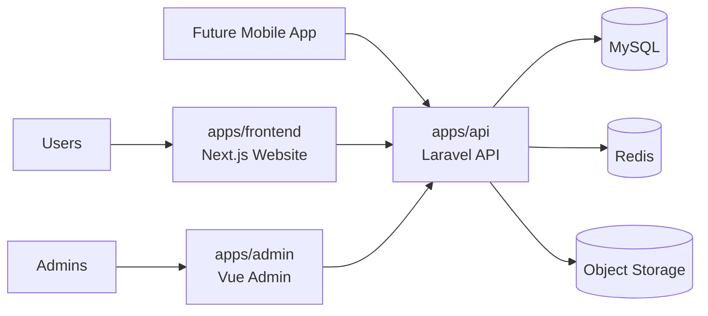
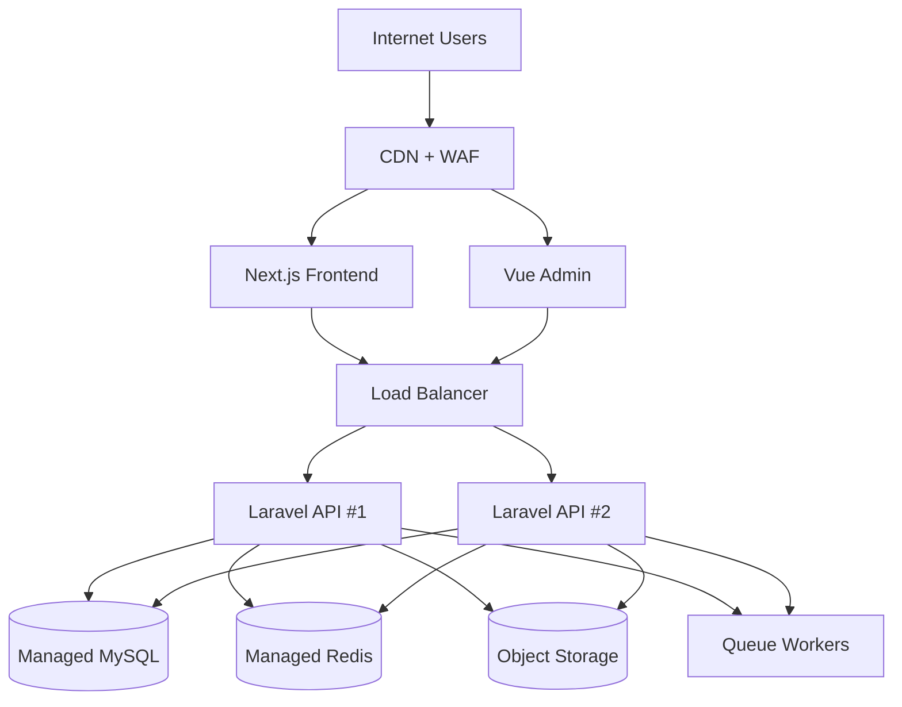

# Tashafy Structure Graph

## Simple Graph (Presentation-Friendly)

```mermaid
flowchart LR
    Users[Users]
    Admins[Admins]
    FutureMobile[Future Mobile App]

    Frontend[apps/frontend<br/>Next.js Website]
    Admin[apps/admin<br/>Vue Admin]
    API[apps/api<br/>Laravel API]

    DB[(MySQL)]
    Cache[(Redis)]
    Storage[(Object Storage)]

    Users --> Frontend
    Admins --> Admin
    FutureMobile --> API

    Frontend --> API
    Admin --> API
    API --> DB
    API --> Cache
    API --> Storage
```

## Deployment-Oriented Graph (Infra View)

```mermaid
flowchart TB
    Internet[Internet Users] --> CDN[CDN + WAF]
    CDN --> FE[Next.js Frontend]
    CDN --> AD[Vue Admin]
    FE --> LB[Load Balancer]
    AD --> LB
    LB --> API1[Laravel API #1]
    LB --> API2[Laravel API #2]
    API1 --> DB[(Managed MySQL)]
    API2 --> DB
    API1 --> REDIS[(Managed Redis)]
    API2 --> REDIS
    API1 --> OBJ[(Object Storage)]
    API2 --> OBJ
    API1 --> W[Queue Workers]
    API2 --> W
```
